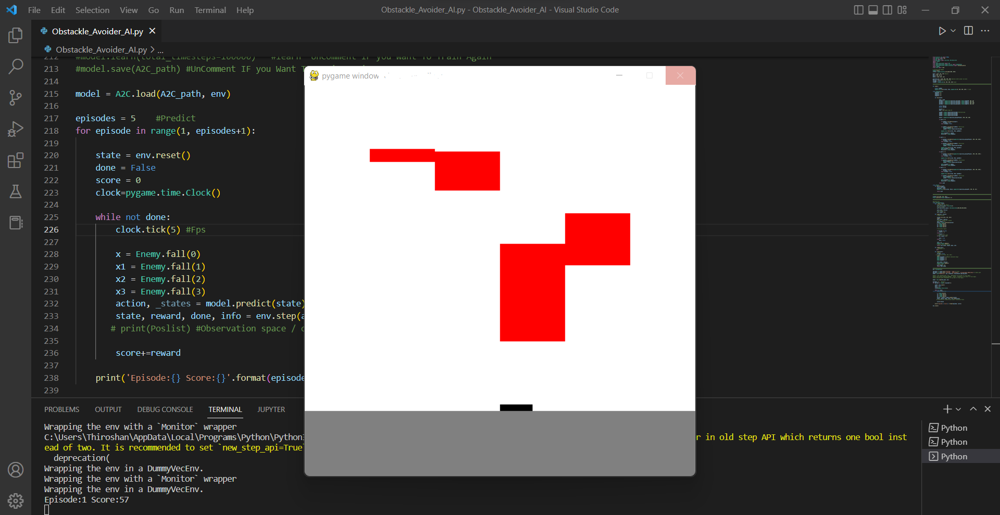

# Python Re-Inforcement Learning (AI) | AI Tries to Avoid Falling Blocks 

 <h3> Goal for the AI </h3>
 
The Goal for the AI is to Avoid falling objects from sky

<h3> What Packages is used </h3>

<ul>
  <li> Open AI</li>
  <li> Stable Baseline3</li>
  <li> PyTorch </li>
  <li> PyGame</li>
  <li> Open AI Gym</li>
</ul>  

<h3> How Does AI Plays </h3>

The Observation Space is --> <b> MultiDescrete([600,600,600,600]) </b>

AI can identify objects in <b>4 Columns</b> (4 dimension array) of max values <b>600</b> (600 height prixels)

The Action Space --> <b> Decrete(4) </b>

 Player / AI can move 4 different Columns 

<h3> About Obstackle </h3>

 Obstackle falls (Red Sqaure) in 4 columns with different size and random speed 

<h3> How Does The Environment Render </h3>

Here I use <b> PyGame </b> Package to Render Custom Environmnet 

<h3> How good is Trained Model here</h3>

 (Train model is inside Saved Model Folder 

 Trained model is good (Trained 100K Steps) ! but you can get way better by <b> UnCommenting Train code lines for x number of time  </b>  to get better Result 

 <b> You can use pretrained model if you dont wont to train again <b> 

<h3> Requirments specs</h3>

 Having Dedicated GPU recomeneded 

 or it uses CPU without any problem 

